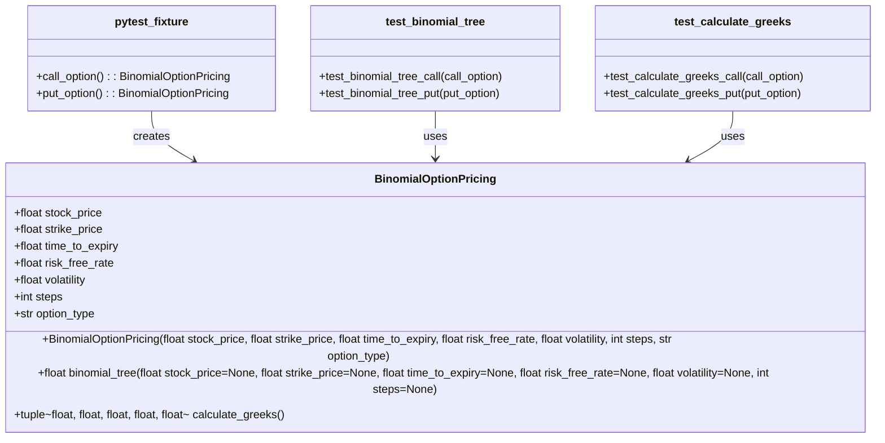

[](https://codecov.io/gh/arturogonzalezm/equity_options)
[](https://github.com/arturogonzalezm/equity_options/actions/workflows/workflow.yml)
[](https://opensource.org/licenses/MIT)

# Binomial Option Pricing Model

This repository contains the implementation of the Binomial Option Pricing Model for calculating the price of European call and put options. It also includes functionality to calculate the Greeks (Delta, Gamma, Vega, Theta, Rho) of the options.

## BinomialOptionPricing Class

The `BinomialOptionPricing` class is used to calculate the price of a European call or put option using the binomial tree model. It also provides methods to calculate the Greeks of the option.

### Initialization

The class is initialized with the following parameters:
- `stock_price`: The current price of the underlying stock.
- `strike_price`: The strike price of the option.
- `time_to_expiry`: The time to expiry of the option in years.
- `risk_free_rate`: The risk-free interest rate.
- `volatility`: The volatility of the underlying stock.
- `steps`: The number of steps in the binomial tree.
- `option_type`: The type of the option ("call" or "put").

```bash
python -m pip install --upgrade pip
```

```bash
python -m pip install -r requirements.txt
```

```bash
streamlit run app.py
```
  

### Methods

#### `binomial_tree`

Calculates the price of the option using the binomial tree model.

```python
def binomial_tree(self, stock_price=None, strike_price=None, time_to_expiry=None, risk_free_rate=None, volatility=None, steps=None):
    # Parameters are optional, if not provided the class attributes will be used.
    # Calculate the necessary parameters for the binomial model.
    dt = time_to_expiry / steps
    u = np.exp(volatility * np.sqrt(dt))
    d = 1 / u
    q = (np.exp(risk_free_rate * dt) - d) / (u - d)

    # Initialize asset prices at maturity
    asset_prices = np.zeros(steps + 1)
    for i in range(steps + 1):
        asset_prices[i] = stock_price * (u ** (steps - i)) * (d ** i)

    # Initialize option values at maturity
    option_values = np.zeros(steps + 1)
    for i in range(steps + 1):
        if self.option_type == "call":
            option_values[i] = max(0, asset_prices[i] - strike_price)
        else:
            option_values[i] = max(0, strike_price - asset_prices[i])

    # Backward induction
    for step in range(steps - 1, -1, -1):
        for i in range(step + 1):
            option_values[i] = np.exp(-risk_free_rate * dt) * (q * option_values[i] + (1 - q) * option_values[i + 1])
            asset_prices[i] = asset_prices[i] / u
            if self.option_type == "call":
                option_values[i] = max(option_values[i], asset_prices[i] - strike_price)
            else:
                option_values[i] = max(option_values[i], strike_price - asset_prices[i])

    return option_values[0]
```

## Project Structure

```sh
equity_options/
│
├── backend/
│   ├── __init__.py
│   ├── options_facade.py
│   └── singleton_logger.py
│
├── tests/
│   ├── __init__.py
│   ├── test_options_facade.py
│
├── app.py
├── requirements.txt
└── README.md
```

## Testing

Run the unit tests using `pytest`:

```sh
pytest
```

## Class Diagram



### Explanation

- **BinomialOptionPricing**: The main class responsible for calculating the price and Greeks of an option using the binomial tree model.
  - Attributes: `stock_price`, `strike_price`, `time_to_expiry`, `risk_free_rate`, `volatility`, `steps`, `option_type`.
  - Methods: `__init__`, `binomial_tree`, `calculate_greeks`.

- **TestBinomialOptionPricing**: The test class that contains the unit tests for the `BinomialOptionPricing` class.
  - Methods: `test_binomial_tree_call`, `test_binomial_tree_put`, `test_calculate_greeks_call`, `test_calculate_greeks_put`.

- **TestFixtures**: A helper class that provides fixtures for the unit tests.
  - Methods: `call_option`, `put_option`.

- The `TestBinomialOptionPricing` class uses the `TestFixtures` class to get instances of `BinomialOptionPricing` for testing.
- The `TestFixtures` class creates instances of `BinomialOptionPricing`.


### Summary

- The `BinomialOptionPricing` class provides methods to calculate the price and Greeks of European options using the binomial tree model.
- Unit tests are written using `pytest` to ensure the correctness of the implementation.
- The README file explains the class, its methods, and how to run the tests.


---

## License

This project is licensed under the MIT License - see the [LICENSE](LICENSE) file for details.


