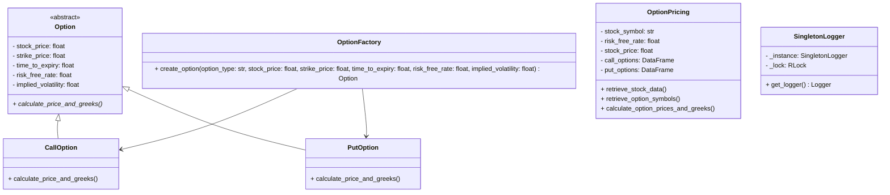

[](https://codecov.io/gh/arturogonzalezm/equity_options)
[](https://github.com/arturogonzalezm/equity_options/actions/workflows/workflow.yml)
[](https://opensource.org/licenses/MIT)

# Option Pricing Calculator

This project provides an implementation of an option pricing calculator using the Black-Scholes model. It includes classes for call and put options, an abstract `Option` class, and functionality to retrieve stock and option data from Yahoo Finance. The project also includes unit tests using `pytest`.

## Table of Contents

- [Installation](#installation)
- [Usage](#usage)
- [Project Structure](#project-structure)
- [Testing](#testing)
- [Class Diagram](#class-diagram)
- [Math Explanation](#math-explanation)
- [Explanation](#explanation)
- [License](#license)

## Installation

1. Clone the repository:
   ```sh
   git clone https://github.com/arturogonzalezm/equity_options.git
   cd equity_options
    ```
   
2. Install the required packages:

    ```sh
    python.exe -m pip install --upgrade pip
    python.exe -m pip install -r .\requirements.txt
    ```
   
## Usage

1. Run the Streamlit application:
   ```sh
   streamlit run app.py
   ```
   
2. Enter the stock symbol, risk-free rate, and option expiry date.
3. Click the "Calculate" button to retrieve the option prices and Greeks.
4. View the calculated option prices and Greeks in the table.
5. Click the "Download" button to save the results as a CSV file.
6. Click the "Plot" button to display a plot of the option prices and Greeks.
7. Click the "Reset" button to clear the input fields and results.
8. Click the "Toggle Log" button to show or hide the log messages.
9. Click the "Clear Log" button to clear the log messages.

## Project Structure

```sh
option-pricing-calculator/
│
├── backend/
│   ├── __init__.py
│   ├── options_facade.py
│   └── singleton_logger.py
│
├── tests/
│   ├── __init__.py
│   ├── test_options_facade.py
│
├── app.py
├── requirements.txt
└── README.md
```

## Testing

Run the unit tests using `pytest`:

```sh
pytest
```

## Class Diagram



### Math Explanation

```latex
$C = S_0 \Phi(d_1) - X e^{-rT} \Phi(d_2)$
$P = X e^{-rT} \Phi(-d_2) - S_0 \Phi(-d_1)$

$d_1 = \frac{\ln(S_0 / X) + (r + \sigma^2 / 2)T}{\sigma \sqrt{T}}$
$d_2 = d_1 - \sigma \sqrt{T}$
```

### Explanation

- **Installation**: Provides step-by-step instructions for setting up the project.
- **Usage**: Describes how to run the application using Streamlit.
- **Project Structure**: Lists the directory structure of the project.
- **Testing**: Explains how to run the unit tests using `pytest`.
- **Contributing**: Provides guidelines for contributing to the project.
- **License**: States the project's license.

Feel free to adjust the content based on your project's specifics, such as the repository URL and any additional setup steps.

---

## License

This project is licensed under the MIT License - see the [LICENSE](LICENSE) file for details.


